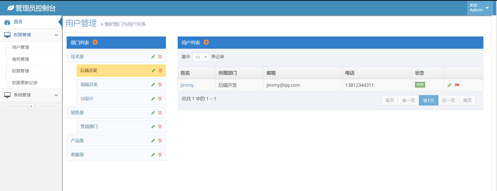
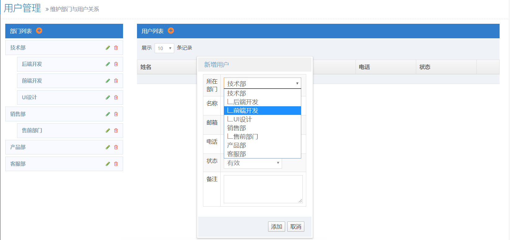
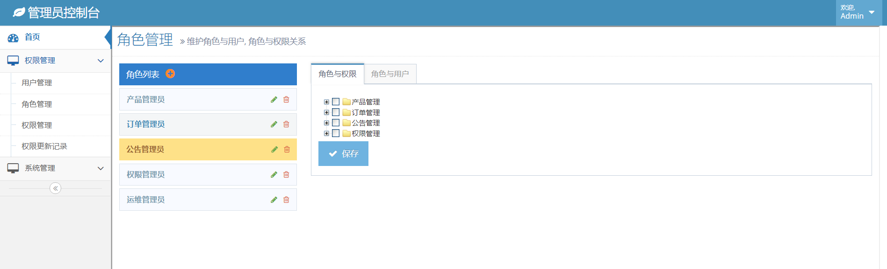
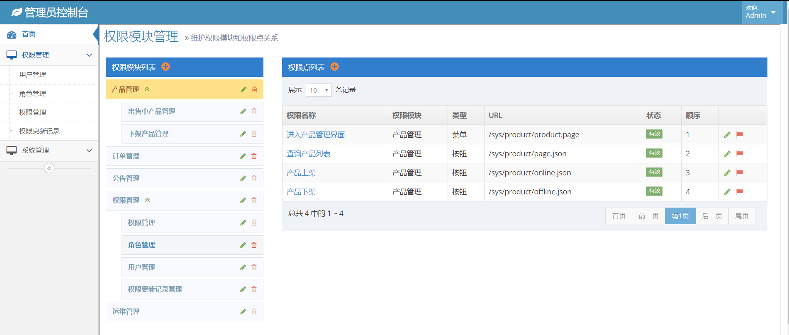
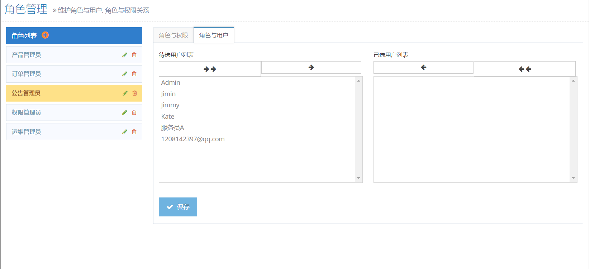
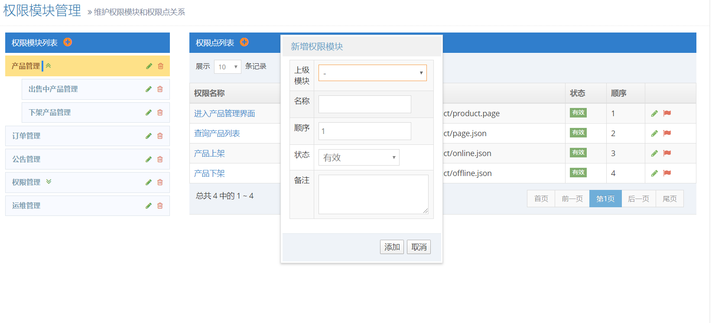
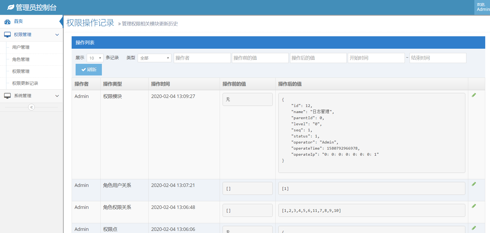

# 企业权限管理系统

传统的Maven构建的单体Web项目。前后端通过Json交换数据

## 模块划分

### 1.部门模块

新增部门

更新部门

删除部门

部门属性结构展示

### 2.用户模块

新增用户

更新用户

根据部门分页获取用户列表并展示

### 3.角色模块

新增角色

更新角色

删除角色

获取角色列表并展示

### 4.权限模块

新增权限模块

更新权限模块

删除权限模块

权限模块树形结构展示

### 5.用户关系维护

获取指定角色已分配用户列表

获取指定角色未分配用户列表

更新角色-用户关系

### 6.权限点模块

新增权限点

更新权限点

根据权限模块分页获取权限点列表并展示

### 7.权限关系维护

角色-权限树形结构列表

更新角色-权限关系

### 8.日志模块

带查询条件分页展示权限日志

根据权限日志撤销之前的操作

### 9.Redis缓存模块

Redis缓存用户权限

Redis缓存系统权限

已缓存权限清理

## 运用的技术

Spring+SpringMVC+MyBatis+JQuaery+Boostrap+Mustache+zTree+Duallistbox+Redis

